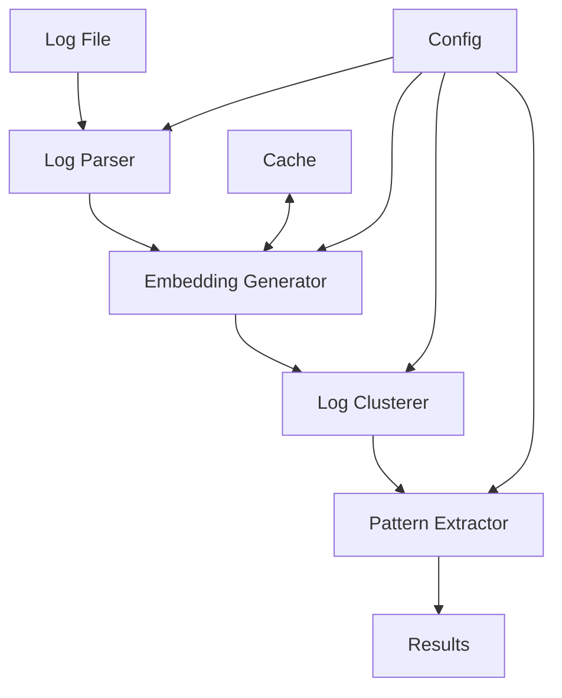

# Architecture Overview

Sherlog-parser is designed with modularity and scalability in mind. This document provides an overview of the system architecture and how different components interact.

## High-Level Architecture

## Core Components

### 1. Log Parser (`src/core/pipeline.py`)
- Entry point for log processing
- Handles file reading and preprocessing
- Orchestrates the complete analysis pipeline
- Implements Dagster pipeline for workflow management

### 2. Embedding Generator (`src/core/embeddings.py`)
- Converts log messages to vector embeddings
- Uses sentence transformers for semantic understanding
- Implements efficient caching mechanism
- Handles batch processing for performance

### 3. Log Clusterer (`src/core/clustering.py`)
- Performs incremental clustering on embeddings
- Uses scikit-learn for clustering algorithms
- Maintains cluster state across batches
- Optimizes memory usage for large datasets

### 4. Pattern Extractor
- Extracts regex patterns from log clusters
- Identifies variable and static parts
- Calculates pattern confidence scores
- Generates human-readable patterns

## Data Flow

1. **Input Processing**
   - Log files are read in chunks
   - Basic preprocessing is applied
   - Lines are validated and normalized

2. **Embedding Generation**
   - Log lines are converted to embeddings
   - Embeddings are cached for reuse
   - Batch processing for efficiency

3. **Clustering**
   - Embeddings are clustered incrementally
   - Cluster states are maintained
   - Similar logs are grouped together

4. **Pattern Extraction**
   - Patterns are extracted from clusters
   - Variable parts are identified
   - Confidence scores are calculated

5. **Result Generation**
   - Results are formatted and validated
   - Patterns are associated with clusters
   - Sample lines are included

## Key Design Decisions

### 1. Incremental Processing
- Designed to handle large log files
- Processes data in manageable chunks
- Maintains state between batches
- Optimizes memory usage

### 2. Caching Strategy
- Embeddings are cached using `diskcache`
- Cache is persistent across runs
- Implements TTL for cache entries
- Configurable cache size limits

### 3. Type Safety
- Uses Pydantic models throughout
- Strong typing with mypy
- Runtime type validation
- Clear data contracts

### 4. Pipeline Management
- Dagster for workflow orchestration
- Visual pipeline monitoring
- Asset materialization
- Dependency tracking

## Configuration Management

The system uses a layered configuration approach:

1. **Default Configuration**
   - Hardcoded sensible defaults
   - Basic functionality without config

2. **YAML Configuration**
   - Override defaults via YAML
   - Environment-specific settings
   - Feature toggles

3. **Environment Variables**
   - Runtime configuration
   - Sensitive information
   - Deployment settings

## Error Handling

Implements a comprehensive error handling strategy:

1. **Custom Exceptions**
   - Domain-specific error types
   - Clear error hierarchies
   - Informative error messages

2. **Error Recovery**
   - Graceful degradation
   - State recovery mechanisms
   - Automatic retries where appropriate

3. **Logging**
   - Structured logging
   - Log levels for different scenarios
   - Contextual information

## Testing Strategy

The project follows a comprehensive testing approach:

1. **Unit Tests**
   - Component-level testing
   - Mocked dependencies
   - Fast execution

2. **Integration Tests**
   - Component interaction testing
   - Real dependencies
   - Pipeline validation

3. **Performance Tests**
   - Throughput testing
   - Memory usage monitoring
   - Scalability validation

## Future Considerations

Areas identified for future enhancement:

1. **Scalability**
   - Distributed processing
   - Horizontal scaling
   - Cloud deployment options

2. **Machine Learning**
   - Advanced clustering algorithms
   - Anomaly detection
   - Pattern prediction

3. **Integration**
   - Additional input formats
   - Export capabilities
   - Third-party integrations 